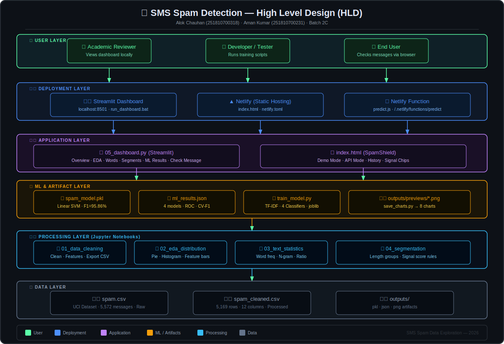
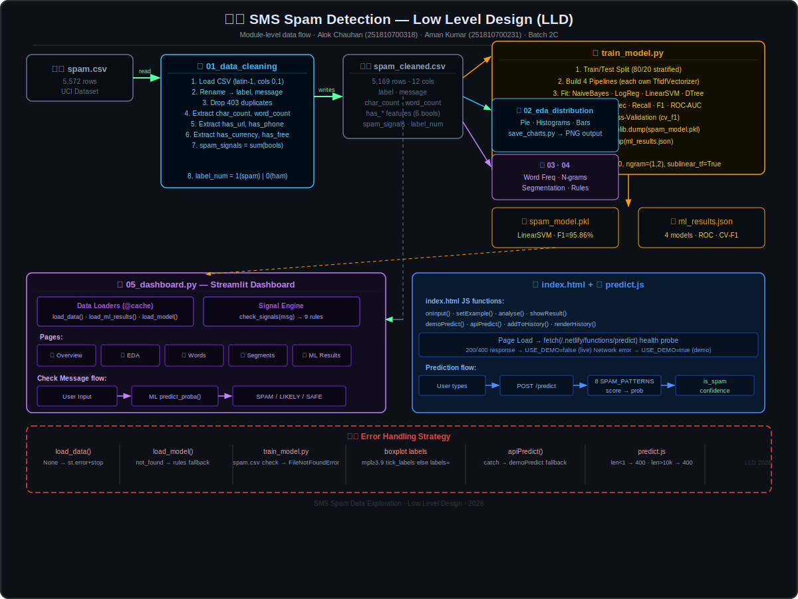
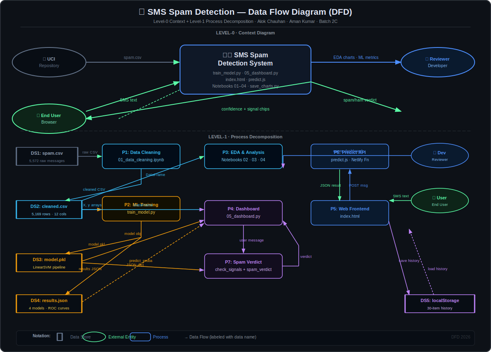
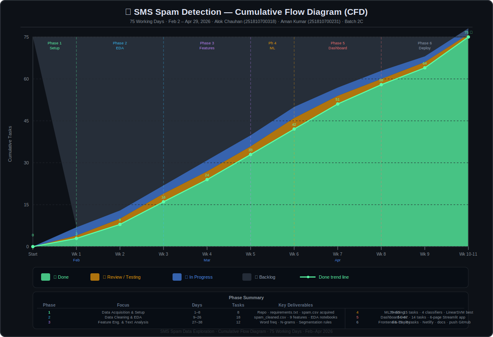

# 📩 SMS Spam Data Exploration

> **Real data. Real patterns. Real insights.**  
> A complete end-to-end project that goes from raw SMS messages to a live spam detector — with machine learning, interactive dashboard, and a web app anyone can use.

**Authors:** Alok Chauhan (251810700318) · Aman Kumar (251810700231) · **Batch 2C**  
**Dataset:** UCI SMS Spam Collection — 5,572 real SMS messages  
**Best Model:** Linear SVM — **F1: 95.86% · Accuracy: 98.92%**

---

## 🎯 What Is This Project?

Every day, millions of spam SMS messages are sent — fake prizes, scam links, phishing attacks. Most spam filters use simple word blacklists that spammers easily bypass.

This project **digs into the data** to understand *why* spam looks the way it does:

- 📐 Spam messages are **2–3× longer** than normal messages
- 🔗 URLs appear **40× more often** in spam
- 📞 Phone numbers are the **single strongest spam signal**
- 📊 Messages with **3+ spam signals** are almost 100% spam

We then used these findings to build **4 machine learning classifiers** and a **live web detector**.

---

## 🚀 Live Demo

| What | Where |
|------|-------|
| 🌐 **SpamShield Web App** | Deploy to Netlify — paste any SMS, get instant result |
| 📊 **Analytics Dashboard** | Run locally with `run_dashboard.bat` |
| ⚡ **Prediction API** | `POST /.netlify/functions/predict` |

---

## 📁 Project Structure

```
SMS-Spam-Data-Exploration/
│
├── 📓 01_data_cleaning.ipynb      → Clean data, extract 9 features
├── 📓 02_eda_distribution.ipynb   → Charts: distribution, length, features
├── 📓 03_text_statistics.ipynb    → Word frequency, n-gram analysis
├── 📓 04_segmentation.ipynb       → Find patterns by message group
│
├── 🐍 train_model.py              → Train 4 ML classifiers, save best
├── 🐍 05_dashboard.py             → Interactive 6-page Streamlit dashboard
├── 🐍 save_charts.py              → Pre-render all charts as PNG files
│
├── 🌐 index.html                  → SpamShield — browser spam detector
├── ⚡ netlify/functions/predict.js → Serverless prediction API
│
├── 📁 outputs/
│   ├── spam_model.pkl             → Saved Linear SVM pipeline
│   ├── ml_results.json            → All model metrics + ROC curve data
│   └── previews/                  → 8 pre-rendered chart images
│
├── 📁 docs/
│   ├── HLD.md / LLD.md / DFD.md / CFD.md   → Full written design docs
│   └── diagrams/                             → SVG visual diagrams
│
├── spam.csv                       → Raw UCI dataset (5,572 messages)
├── spam_cleaned.csv               → Processed dataset (12 columns)
├── requirements.txt               → Python dependencies (version-pinned)
├── netlify.toml                   → Netlify deployment config
└── run_dashboard.bat              → One-click dashboard launcher (Windows)
```

---

## 🧰 Technology Stack

| Category | Tools |
|----------|-------|
| **Language** | Python 3.x |
| **Data** | Pandas, NumPy |
| **ML** | Scikit-learn (TF-IDF + 4 classifiers), Joblib |
| **Visualization** | Matplotlib, Seaborn |
| **Dashboard** | Streamlit |
| **Frontend** | HTML · Vanilla CSS · Vanilla JavaScript |
| **Backend API** | Node.js (Netlify Serverless Function) |
| **Deployment** | Netlify |
| **Version Control** | Git & GitHub |

---

## ▶️ How to Run

### 1. Clone the repository

```bash
git clone https://github.com/Amankumar-10012004/SMS-Spam-Data-Exploration.git
cd SMS-Spam-Data-Exploration
```

### 2. Install dependencies

```bash
pip install -r requirements.txt
```

### 3. Run the data cleaning notebook first

```bash
jupyter notebook
# Open and run: 01_data_cleaning.ipynb
# This creates spam_cleaned.csv
```

### 4. Train the ML model

```bash
python train_model.py
# Creates: outputs/spam_model.pkl + outputs/ml_results.json
```

### 5. Launch the dashboard

```bash
# Option A — Windows (double-click or run):
run_dashboard.bat

# Option B — Any OS:
streamlit run 05_dashboard.py
```

Then open **http://localhost:8501** in your browser.

---

## 📊 Machine Learning Results

| Model | Accuracy | Precision | Recall | F1 Score | ROC-AUC |
|-------|----------|-----------|--------|----------|---------|
| **Linear SVM** ⭐ | **98.92%** | 98.58% | 93.29% | **95.86%** | 98.98% |
| Naive Bayes | 98.74% | 99.27% | 91.28% | 95.10% | 99.02% |
| Logistic Regression | 98.57% | 99.26% | 89.93% | 94.37% | 99.10% |
| Decision Tree | 97.22% | 96.09% | 82.55% | 88.81% | 87.74% |

> **Why F1 and not just Accuracy?** The dataset has 87% normal (ham) messages. A model that calls everything "ham" would be 87% accurate — but useless. F1 score balances catching spam (recall) with not blocking normal messages (precision).

---

## 🔍 Key Spam Signals Found

| Signal | Spam Rate | Ham Rate |
|--------|----------|---------|
| Contains a phone number (10+ digits) | ~60% | ~1% |
| Contains a URL (http/www) | ~35% | ~1% |
| Contains currency symbol (£, $) | ~25% | ~0.3% |
| Contains word "FREE" | ~30% | ~0.5% |
| Message length 101–160 chars | ~40% spam rate | — |
| **3+ signals combined** | **~100% spam** | — |

---

## 🏗️ High Level Design (HLD)

The system is organized into **6 layers**, from raw data at the bottom to the end user at the top.



> **In simple terms:** Raw SMS data flows up through cleaning → feature extraction → ML training → dashboard/web app → the user gets a spam verdict. Each layer has a clear job.

📄 [Full HLD documentation](docs/HLD.md)

---

## ⚙️ Low Level Design (LLD)

This shows the **internal wiring** of each module — which functions exist, what they do, and how data passes between them.



> **In simple terms:** Think of this as the blueprint inside each building. It shows exactly what happens step-by-step inside the data cleaning notebook, the training script, the dashboard pages, and the prediction API.

📄 [Full LLD documentation](docs/LLD.md)

---

## 🔁 Data Flow Diagram (DFD)

Shows **where data comes from, where it goes**, and what transforms it along the way.



> **In simple terms:** `spam.csv` enters the system → gets cleaned → features extracted → model trained → dashboard reads it → user submits a message → API checks it → result displayed. Every arrow shows data moving.

📄 [Full DFD documentation](docs/DFD.md)

---

## 📈 Cumulative Flow Diagram (CFD)

Shows **how much work was completed** week by week across the 75-day project.



> **In simple terms:** The green area (Done) grows steadily from bottom-left to top-right. The shrinking blue area (Backlog) shows work being completed at a consistent pace of ~1 task per day throughout the project.

📄 [Full CFD documentation](docs/CFD.md)

---

## 🛡️ Design Decisions

| Decision | Why |
|----------|-----|
| Each ML pipeline gets its **own TF-IDF** instance | A shared instance caused data leakage in cross-validation — each run was contaminating the others |
| **CalibratedClassifierCV** wraps LinearSVC | LinearSVC doesn't support `predict_proba()` natively — calibration adds probability scores |
| Dashboard uses **`@st.cache_data`** | Without caching, the 5,500-row CSV reloads from disk on every user click |
| Web app starts in **demo mode** | The Netlify function isn't available locally — a built-in JS analyser runs as fallback so the page always works |
| **`find_file()`** tries multiple paths | The project runs from different folders on different machines — this makes it portable |
| `itertools.chain` for word counting | `sum([list1, list2...], [])` is O(n²) — `chain` is O(n) and stays fast on large datasets |

---

## 📐 Feature Engineering

These are the 9 features extracted from each SMS message:

| Feature | How It's Computed | Why It Matters |
|---------|------------------|----------------|
| `char_count` | `len(message)` | Spam tends to be much longer |
| `word_count` | `len(message.split())` | Spam packs in more words |
| `has_url` | `'http' or 'www.' in message` | Spam drives traffic to websites |
| `has_phone` | 10+ consecutive digits | Spammers leave callback numbers |
| `has_currency` | `£ $ € ₹` present | Prize/scam messages mention money |
| `has_free` | word `free` present | Classic spam bait |
| `has_call` | word `call` present | Calls-to-action are spam signals |
| `has_txt` | word `txt` or `text` | SMS-specific spam jargon |
| `spam_signals` | Sum of all boolean features | Score ≥ 3 → almost certainly spam |

---

## 📄 License

This project is licensed under the **Apache License 2.0**.  
You are free to use, modify, and distribute it with attribution.

---

## 🙏 Acknowledgement

Dataset: **UCI Machine Learning Repository — SMS Spam Collection Dataset**  
[https://archive.ics.uci.edu/ml/datasets/SMS+Spam+Collection](https://archive.ics.uci.edu/ml/datasets/SMS+Spam+Collection)
