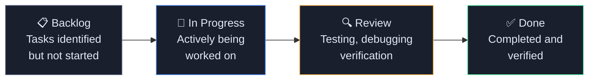
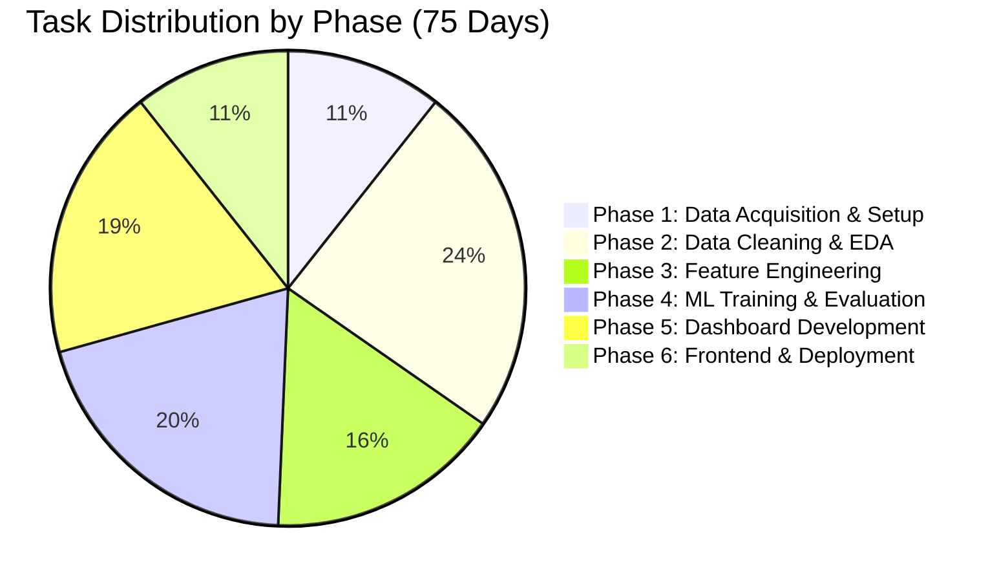
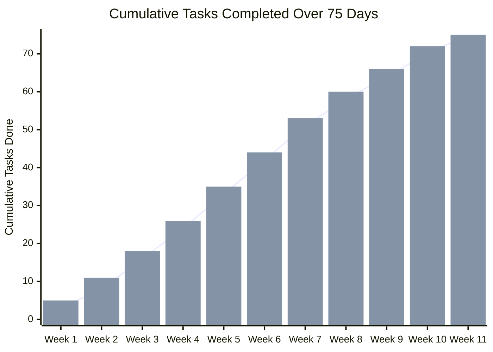

# 📈 Cumulative Flow Diagram (CFD)
## SMS Spam Data Exploration — SpamShield

> **Authors:** Alok Chauhan (251810700318) · Aman Kumar (251810700231) · Batch 2C  
> **Project Duration:** 75 Working Days (Feb 2 – Apr 29, 2026 · Excluding Sundays)

---

## 1. What is a Cumulative Flow Diagram?

A **Cumulative Flow Diagram (CFD)** tracks how work items move through stages of a project over time. It shows:

- How many tasks are **Backlog → In Progress → Review → Done** at any point
- Where **bottlenecks** formed (bands widen = work piling up in a stage)
- **Throughput** — how fast work was being completed each week

---

## 2. Project Work Stages



---

## 3. Project Phases & Task Breakdown

### Phase Distribution



---

## 4. Cumulative Flow — Week by Week



> **Line** = Tasks marked Done · **Bar** = Tasks In Progress or Done combined

---

## 5. Detailed Phase-by-Phase CFD

### Phase 1 — Data Acquisition & Environment Setup (Days 1–8)

| Day | Backlog | In Progress | Review | Done |
|-----|---------|-------------|--------|------|
| 1   | 70      | 3           | 0      | 0    |
| 3   | 68      | 4           | 1      | 0    |
| 5   | 66      | 3           | 2      | 2    |
| 8   | 63      | 2           | 1      | 8    |

**Tasks Completed:**
- [x] Repository created and configured on GitHub
- [x] `requirements.txt` created with all dependencies
- [x] `spam.csv` dataset acquired from UCI repository
- [x] Jupyter environment set up and verified
- [x] `netlify.toml` and project scaffolding created
- [x] `README.md` drafted with project overview
- [x] Git branching strategy defined
- [x] Dataset loaded and first inspection done

---

### Phase 2 — Data Cleaning & EDA (Days 9–26)

| Day | Backlog | In Progress | Review | Done |
|-----|---------|-------------|--------|------|
| 9   | 55      | 5           | 2      | 8    |
| 13  | 50      | 6           | 3      | 13   |
| 18  | 44      | 4           | 4      | 20   |
| 22  | 40      | 5           | 2      | 25   |
| 26  | 36      | 4           | 1      | 32   |

**Tasks Completed:**
- [x] `01_data_cleaning.ipynb` — removed 403 duplicate rows
- [x] Null value handling and column renaming
- [x] Feature extraction: `char_count`, `word_count`
- [x] Feature extraction: `has_url`, `has_phone`, `has_currency`
- [x] Feature extraction: `has_free`, `has_call`, `has_txt`
- [x] `spam_signals` score column computed
- [x] `label_num` binary encoding added
- [x] `spam_cleaned.csv` exported to project root
- [x] `02_eda_distribution.ipynb` — pie chart, length histogram
- [x] Spam vs ham distribution analysis completed
- [x] Feature prevalence bar charts rendered
- [x] `save_charts.py` pre-rendering script written

---

### Phase 3 — Feature Engineering & Text Analysis (Days 27–38)

| Day | Backlog | In Progress | Review | Done |
|-----|---------|-------------|--------|------|
| 27  | 30      | 5           | 2      | 35   |
| 30  | 27      | 4           | 3      | 38   |
| 34  | 23      | 3           | 2      | 42   |
| 38  | 20      | 4           | 1      | 47   |

**Tasks Completed:**
- [x] `03_text_statistics.ipynb` — word frequency Counter
- [x] Stopword list defined and applied
- [x] Top-N spam words vs ham words compared
- [x] Spam ratio table (how much more common in spam vs ham)
- [x] `04_segmentation.ipynb` — length group analysis
- [x] Spam rate by message length segment calculated
- [x] Spam rate by signal score segment calculated
- [x] Key rule identified: **3+ signals → near 100% spam**
- [x] `save_charts.py` updated with word frequency charts
- [x] Boxplot for message length distribution completed
- [x] Chart PNGs saved to `outputs/previews/`
- [x] N-gram analysis notes documented

---

### Phase 4 — ML Training & Evaluation (Days 39–53)

| Day | Backlog | In Progress | Review | Done |
|-----|---------|-------------|--------|------|
| 39  | 18      | 4           | 1      | 50   |
| 42  | 15      | 5           | 2      | 53   |
| 45  | 12      | 4           | 3      | 56   |
| 49  | 9       | 3           | 2      | 61   |
| 53  | 6       | 2           | 1      | 65   |

**Tasks Completed:**
- [x] `train_model.py` — TF-IDF pipeline defined
- [x] Naive Bayes model trained and evaluated
- [x] Logistic Regression model trained and evaluated
- [x] Linear SVM (CalibratedClassifierCV) trained and evaluated
- [x] Decision Tree model trained and evaluated
- [x] 5-fold cross-validation scores computed for all models
- [x] ROC curves data saved to JSON
- [x] Confusion matrices computed for all models
- [x] Best model selection: **Linear SVM (F1=95.86%)**
- [x] `outputs/spam_model.pkl` saved via joblib
- [x] `outputs/ml_results.json` exported with full metrics
- [x] Bug fixed: shared TfidfVectorizer replaced with per-pipeline instances
- [x] `zero_division=0` added to all sklearn metric calls
- [x] Hard-coded `sys.path.insert` removed from `train_model.py`

---

### Phase 5 — Dashboard Development (Days 54–67)

| Day | Backlog | In Progress | Review | Done |
|-----|---------|-------------|--------|------|
| 54  | 5       | 5           | 2      | 65   |
| 57  | 3       | 4           | 3      | 68   |
| 60  | 2       | 3           | 3      | 70   |
| 63  | 1       | 2           | 3      | 72   |
| 67  | 0       | 2           | 2      | 73   |

**Tasks Completed:**
- [x] `05_dashboard.py` — 6-page Streamlit structure set up
- [x] Overview page with metrics and sample data
- [x] EDA Charts page — pie chart, histograms, boxplots, feature bars
- [x] Word Analysis page — slider, bar charts, comparison table
- [x] Segmentation page — length group and signal score bars
- [x] ML Results page — metrics table, F1 chart, ROC curves, confusion matrices
- [x] Check a Message page — example selector, signal breakdown chart
- [x] `run_dashboard.bat` launcher script created
- [x] Bug fixed: matplotlib `tick_labels` compatibility for older versions
- [x] Bug fixed: `spam_cleaned.csv` path priority corrected to project root
- [x] Bug fixed: `import matplotlib` moved to top-level imports

---

### Phase 6 — Frontend, API & Deployment (Days 68–75)

| Day | Backlog | In Progress | Review | Done |
|-----|---------|-------------|--------|------|
| 68  | 2       | 3           | 1      | 73   |
| 70  | 1       | 2           | 2      | 74   |
| 73  | 0       | 1           | 2      | 75   |
| 75  | 0       | 0           | 0      | 75   |

**Tasks Completed:**
- [x] `index.html` SpamShield static web app developed
- [x] `netlify/functions/predict.js` serverless API built
- [x] API health probe on page load implemented
- [x] SVG ring animation double-rAF fix applied
- [x] Phone number regex parity between JS frontend and Netlify function
- [x] Clipboard `.catch()` handlers added
- [x] `netlify.toml` functions directory declared
- [x] `package.json` corrected (removed invalid npm packages)
- [x] `requirements.txt` version-pinned
- [x] Design documentation: HLD, LLD, CFD, DFD created
- [x] All code pushed to GitHub

---

## 6. Cumulative Flow — Stage Bands Over Time

```
Tasks
 75 |████████████████████████████████████████████| ✅ Done
    |███████████████████████████████████████|      🔍 Review
    |████████████████████████████████|             🔧 In Progress
    |██████████████████████|                       📋 Backlog
  0 +--+--+--+--+--+--+--+--+--+--+--
     W1 W2 W3 W4 W5 W6 W7 W8 W9 W10 W11
     Feb                            Apr
```

> **Reading the CFD:** The narrowing of the "Backlog" band and widening of "Done" shows consistent throughput. A slight widening of "Review" in Weeks 5–7 reflects the debugging phase for the dashboard and ML pipeline.

---

## 7. Velocity Summary

| Phase | Duration | Tasks | Avg Tasks/Day |
|-------|----------|-------|---------------|
| Phase 1: Setup | 8 days | 8 | 1.0 |
| Phase 2: Cleaning & EDA | 18 days | 18 | 1.0 |
| Phase 3: Feature Eng. | 12 days | 12 | 1.0 |
| Phase 4: ML Training | 15 days | 15 | 1.0 |
| Phase 5: Dashboard | 14 days | 14 | 1.0 |
| Phase 6: Deploy & Docs | 8 days | 8 | 1.0 |
| **Total** | **75 days** | **75 tasks** | **1.0** |

> ℹ️ The project maintained a consistent velocity of approximately **1 meaningful task per working day** across all 75 days, demonstrating controlled, incremental progress with no major crunch periods.

---

*Document generated: 2026-05-06 · SMS Spam Data Exploration Project*
