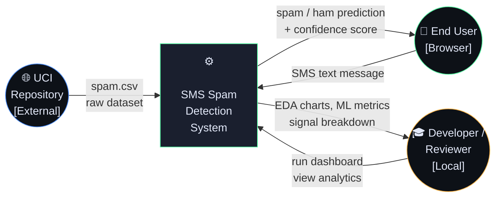
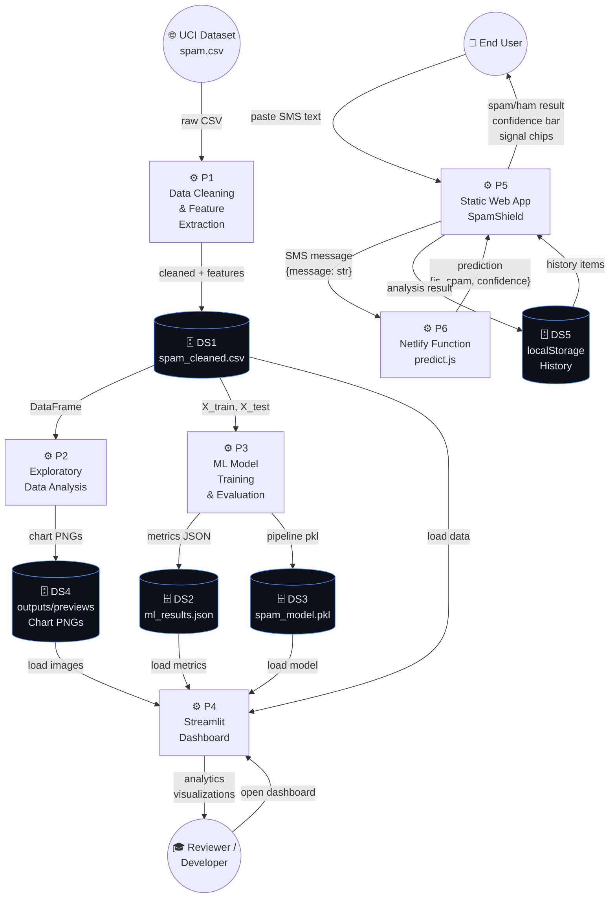
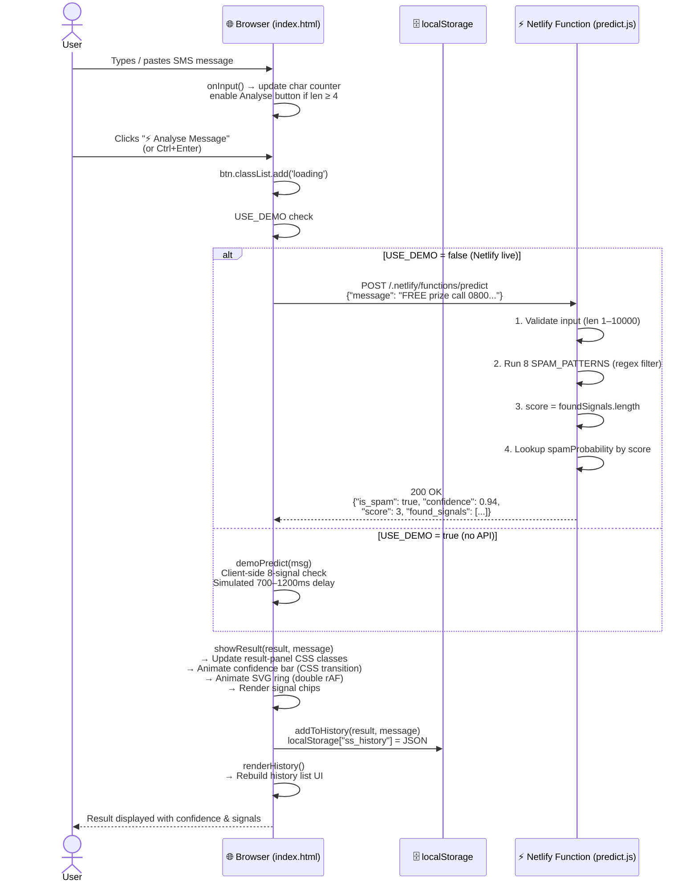
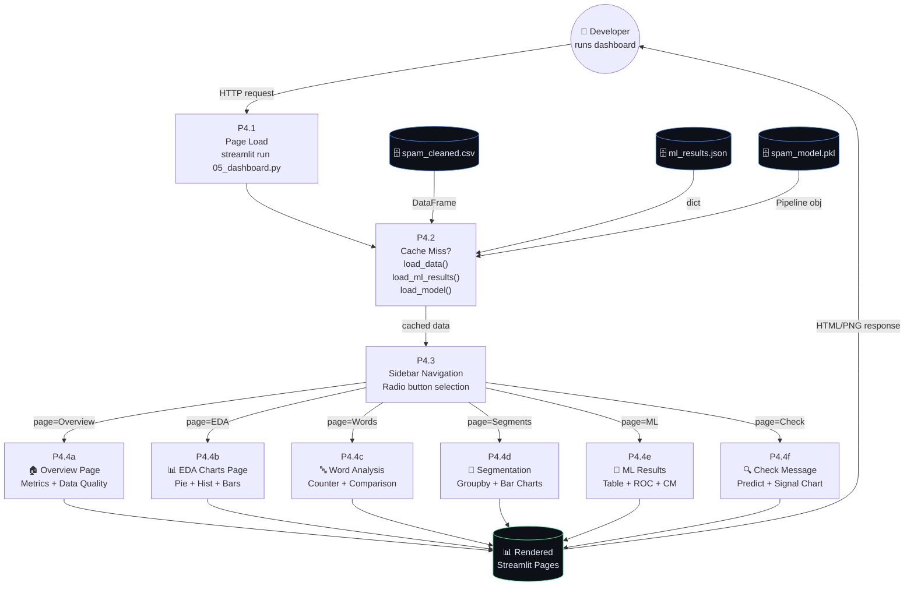

# 🔁 Data Flow Diagram (DFD)
## SMS Spam Data Exploration — SpamShield

> **Authors:** Alok Chauhan (251810700318) · Aman Kumar (251810700231) · Batch 2C

---

## 1. DFD Notation Guide

| Symbol | Meaning |
|--------|---------|
| 🗄️ `[( )]` | **Data Store** — persistent storage (files, databases) |
| ⚙️ `[ ]` | **Process** — transformation or computation |
| 👤 `(( ))` | **External Entity** — user, dataset source, cloud service |
| `→` | **Data Flow** — direction data moves, labeled with what moves |

---

## 2. Level-0 DFD — Context Diagram

*The entire system as a single process with external entities.*

---

## 3. Level-1 DFD — Major Processes

*The system broken into its 6 major processes.*

---

## 4. Level-2 DFD — Process P1: Data Cleaning & Feature Extraction

*Detailed data flows inside the cleaning pipeline.*

```mermaid
flowchart LR
    IN(("spam.csv\nRaw Input"))

    P1A["P1.1\nLoad CSV\nlatin-1 encoding\ncols 0,1 only"]
    P1B["P1.2\nRename Columns\nv1→label\nv2→message"]
    P1C["P1.3\nDrop Duplicates\n403 removed\n5572→5169"]
    P1D["P1.4\nDrop Null Messages\nhandle NaN"]
    P1E["P1.5\nExtract Numeric\nFeatures\nchar_count\nword_count"]
    P1F["P1.6\nExtract Signal\nFeatures\nhas_url · has_phone\nhas_currency · has_free\nhas_call · has_txt"]
    P1G["P1.7\nCompute Scores\nspam_signals = sum\nlabel_num = 0/1"]
    P1H["P1.8\nExport CSV\nspam_cleaned.csv"]

    DS1[("spam_cleaned.csv\n+12 columns")]

    IN -->|"5572 rows\n2 cols"| P1A
    P1A -->|"DataFrame"| P1B
    P1B -->|"labeled DF"| P1C
    P1C -->|"5169 rows"| P1D
    P1D -->|"clean DF"| P1E
    P1E -->|"DF + char/word count"| P1F
    P1F -->|"DF + 6 bool cols"| P1G
    P1G -->|"DF + 12 cols"| P1H
    P1H -->|"writes"| DS1

    style IN fill:#0d1117,stroke:#5bffa8,color:#e2e8f8
    style DS1 fill:#0d1117,stroke:#4d8fff,color:#e2e8f8
```

---

## 5. Level-2 DFD — Process P3: ML Training & Evaluation

*Detailed data flows inside the ML training pipeline.*

```mermaid
flowchart LR
    DS1[("spam_cleaned.csv")]

    P3A["P3.1\nLoad & Split\n80/20 stratified"]
    P3B["P3.2\nBuild Pipelines\n4× TF-IDF + Model"]
    P3C["P3.3\nFit Pipelines\npipe.fit(X_train, y_train)"]
    P3D["P3.4\nPredict & Score\nAccuracy · P · R · F1\nROC-AUC · CM"]
    P3E["P3.5\nCross-Validate\n5-fold CV F1\ncross_val_score()"]
    P3F["P3.6\nSelect Best\nmax(results, key=f1)"]
    P3G["P3.7\nSave Best Pipeline\njoblib.dump()"]
    P3H["P3.8\nSave All Metrics\njson.dump()"]

    DS2[("spam_model.pkl\nBest Pipeline")]
    DS3[("ml_results.json\nAll Metrics")]

    DS1 -->|"X=message\ny=label_num"| P3A
    P3A -->|"X_train/test\ny_train/test"| P3B
    P3B -->|"4 pipelines"| P3C
    P3C -->|"fitted models"| P3D
    P3D -->|"y_pred, y_prob\nmetrics dict"| P3E
    P3E -->|"cv_f1 scores"| P3F
    P3F -->|"best model name"| P3G
    P3F -->|"results dict"| P3H
    P3G -->|"writes"| DS2
    P3H -->|"writes"| DS3

    style DS1 fill:#0d1117,stroke:#4d8fff,color:#e2e8f8
    style DS2 fill:#0d1117,stroke:#5bffa8,color:#e2e8f8
    style DS3 fill:#0d1117,stroke:#5bffa8,color:#e2e8f8
```

---

## 6. Level-2 DFD — Process P5/P6: Real-Time Prediction

*Data flow when a user submits a message on the SpamShield web app.*

---

## 7. Level-2 DFD — Process P4: Streamlit Dashboard

*Data flow when the dashboard is opened and navigated.*

---

## 8. Complete Data Inventory

### Data Stores

| ID | Name | Format | Created By | Read By | Contents |
|----|------|--------|-----------|---------|----------|
| DS1 | `spam.csv` | CSV | UCI Repository | `01_data_cleaning.ipynb`, `train_model.py` | Raw 5,572 SMS messages |
| DS2 | `spam_cleaned.csv` | CSV | `01_data_cleaning.ipynb` | `05_dashboard.py`, `save_charts.py`, `train_model.py` | Cleaned data + 9 features |
| DS3 | `outputs/spam_model.pkl` | Pickle | `train_model.py` | `05_dashboard.py` | Best trained TF-IDF + LinearSVM pipeline |
| DS4 | `outputs/ml_results.json` | JSON | `train_model.py` | `05_dashboard.py`, `index.html` (indirectly) | All model metrics + ROC data |
| DS5 | `outputs/previews/*.png` | PNG | `save_charts.py` | `05_dashboard.py` | Pre-rendered chart images |
| DS6 | `localStorage["ss_history"]` | JSON string | `index.html` (browser) | `index.html` (browser) | Up to 30 recent predictions |

### Data Flows Summary

| Flow | Source | Data | Destination |
|------|--------|------|-------------|
| F1 | UCI Repository | `spam.csv` | `01_data_cleaning.ipynb` |
| F2 | `01_data_cleaning.ipynb` | `spam_cleaned.csv` | project root |
| F3 | `spam_cleaned.csv` | DataFrame | `02_eda_distribution.ipynb` |
| F4 | `spam_cleaned.csv` | DataFrame | `03_text_statistics.ipynb` |
| F5 | `spam_cleaned.csv` | DataFrame | `04_segmentation.ipynb` |
| F6 | `spam_cleaned.csv` | X, y arrays | `train_model.py` |
| F7 | `train_model.py` | `spam_model.pkl` | `outputs/` |
| F8 | `train_model.py` | `ml_results.json` | `outputs/` |
| F9 | `spam_cleaned.csv` | DataFrame | `05_dashboard.py` |
| F10 | `ml_results.json` | dict | `05_dashboard.py` |
| F11 | `spam_model.pkl` | Pipeline | `05_dashboard.py` |
| F12 | User browser | SMS text string | `index.html` |
| F13 | `index.html` | `{message: str}` JSON | `predict.js` |
| F14 | `predict.js` | `{is_spam, confidence, score}` JSON | `index.html` |
| F15 | `index.html` | Prediction result | `localStorage` |
| F16 | `localStorage` | History array | `index.html` |

---

*Document generated: 2026-05-06 · SMS Spam Data Exploration Project*
