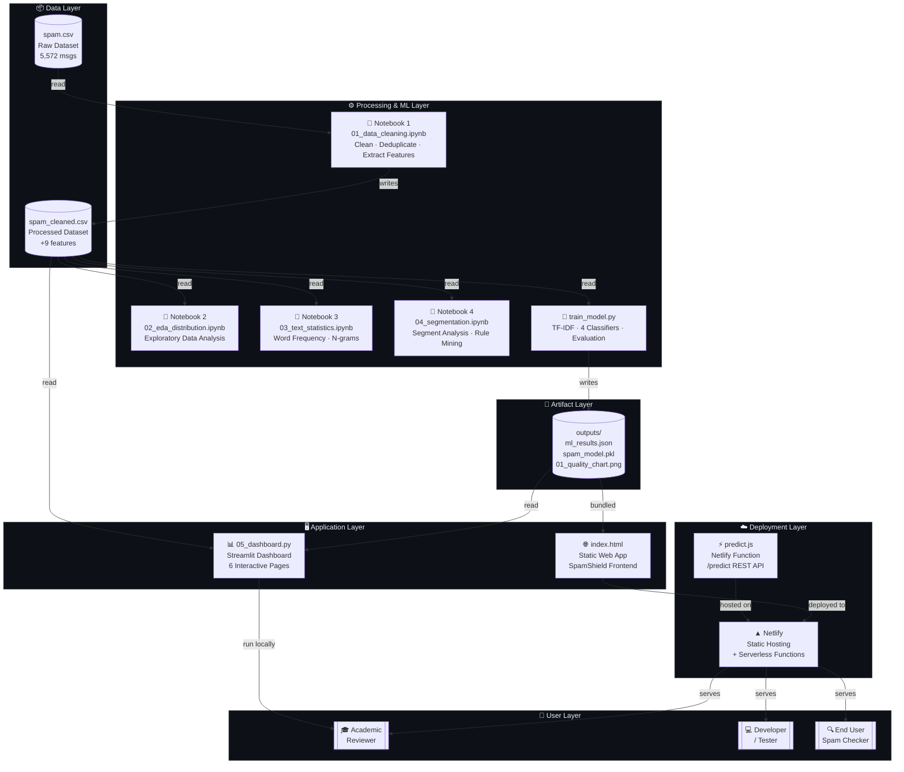
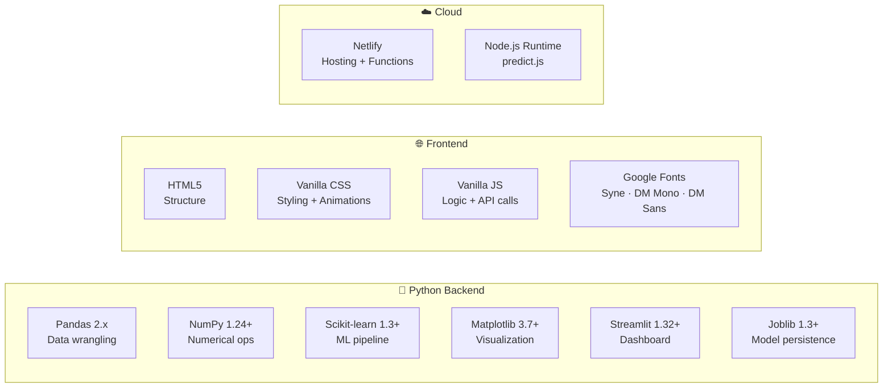

# 🏗️ High Level Design (HLD)
## SMS Spam Data Exploration — SpamShield

> **Authors:** Alok Chauhan (251810700318) · Aman Kumar (251810700231) · Batch 2C  
> **Dataset:** UCI SMS Spam Collection (5,572 messages)

---

## 1. System Overview

The SMS Spam Data Exploration system is a **multi-layer analytics + deployment pipeline** that:

1. Ingests raw SMS data
2. Cleans and enriches it with features
3. Trains and evaluates ML classifiers
4. Serves an interactive dashboard (Streamlit) and a static web app (Netlify)
5. Exposes a serverless prediction API for real-time spam detection

---

## 2. High-Level Architecture Diagram

---

## 3. System Components

### 3.1 Data Layer

| Component | Description | Location |
|-----------|-------------|----------|
| `spam.csv` | Raw UCI dataset, 5,572 SMS messages, columns: `label`, `message` + 3 unnamed noise columns | Project root |
| `spam_cleaned.csv` | Cleaned dataset with 9 extracted features | Project root |

### 3.2 Processing & ML Layer

| Component | Responsibility | Output |
|-----------|---------------|--------|
| `01_data_cleaning.ipynb` | Remove duplicates (403 removed), handle nulls, extract features | `spam_cleaned.csv` |
| `02_eda_distribution.ipynb` | Distribution charts, length histograms, feature prevalence bars | Charts (PNG) |
| `03_text_statistics.ipynb` | Word frequency, n-gram analysis, vocabulary statistics | Analysis insights |
| `04_segmentation.ipynb` | Segment messages by length, signal score; derive moderation rules | Rule thresholds |
| `train_model.py` | TF-IDF vectorization, train 4 classifiers, cross-validate, save best | `spam_model.pkl`, `ml_results.json` |

### 3.3 ML Pipeline

| Step | Detail |
|------|--------|
| Vectorizer | TF-IDF, max 6,000 features, (1,2)-grams, sublinear_tf=True |
| Train/Test Split | 80/20 stratified, random_state=42 |
| Models Trained | Naive Bayes · Logistic Regression · Linear SVM · Decision Tree |
| Evaluation Metrics | Accuracy · Precision · Recall · F1 · ROC-AUC · CV-F1 (5-fold) |
| Best Model | Linear SVM — F1: **95.86%**, Accuracy: **98.92%** |

### 3.4 Application Layer

| Component | Technology | Pages / Features |
|-----------|-----------|-----------------|
| `05_dashboard.py` | Streamlit 1.32+ | Overview · EDA Charts · Word Analysis · Segmentation · ML Results · Check a Message |
| `index.html` | Vanilla HTML/CSS/JS | Hero · Analyser · Dataset Stats · History |

### 3.5 Deployment Layer

| Component | Role |
|-----------|------|
| Netlify Static Hosting | Serves `index.html` at production URL |
| `netlify/functions/predict.js` | Serverless Node.js function at `/.netlify/functions/predict` — 8-signal rule-based classifier |
| `netlify.toml` | Build config: `publish="."`, functions directory declared |

---

## 4. Technology Stack

---

## 5. Key Design Decisions

| Decision | Rationale |
|----------|-----------|
| Separate `train_model.py` from notebooks | Notebooks are exploratory; training script is reproducible and CI-friendly |
| Each pipeline uses its own `TfidfVectorizer` instance | Shared instance caused data leakage in cross-validation |
| `CalibratedClassifierCV` wrapping `LinearSVC` | LinearSVC has no `predict_proba`; calibration enables confidence scores |
| Demo-mode fallback in `index.html` | Netlify function may be unavailable locally — degrades gracefully |
| `@st.cache_data` / `@st.cache_resource` | Prevents reloading 5,572-row CSV on every Streamlit interaction |
| `find_file()` multi-path search | Works regardless of whether script is run from root, subfolder, or CI |

---

## 6. Non-Functional Requirements

| NFR | Implementation |
|-----|---------------|
| **Performance** | Streamlit caching; `itertools.chain` O(n) word flattening |
| **Reliability** | Column existence guards; `zero_division=0` on metrics; `vmax ≥ 1` on imshow |
| **Portability** | No hard-coded paths; multi-location `find_file()`; version-pinned `requirements.txt` |
| **Security** | 10,000-char input limit on Netlify function; HTML-escaped history items |
| **Deployability** | Single `netlify.toml`; no server required for static app |

---

*Document generated: 2026-05-06 · SMS Spam Data Exploration Project*
