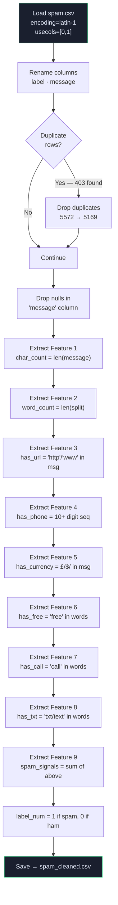
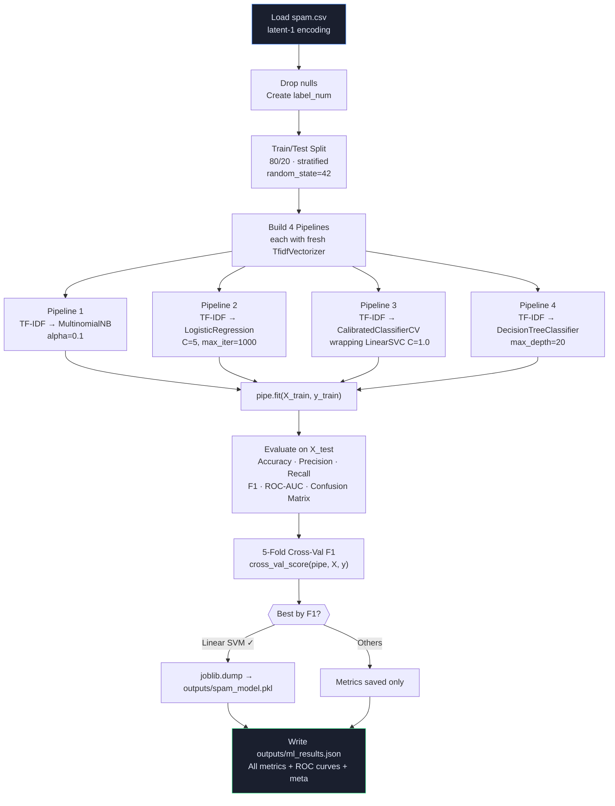
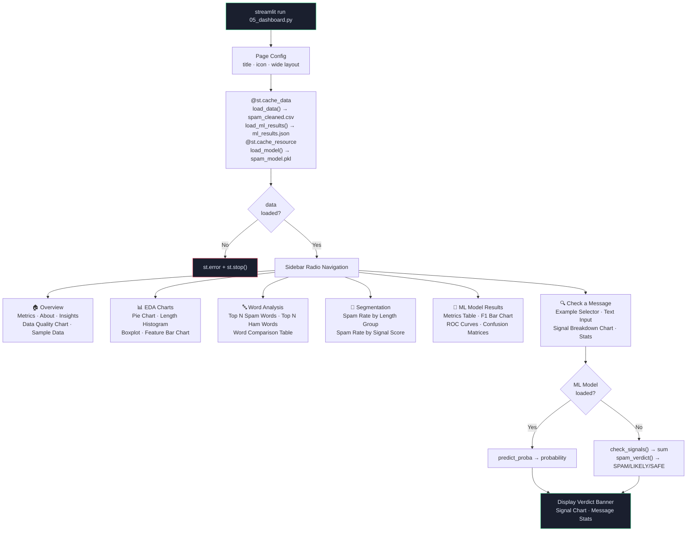
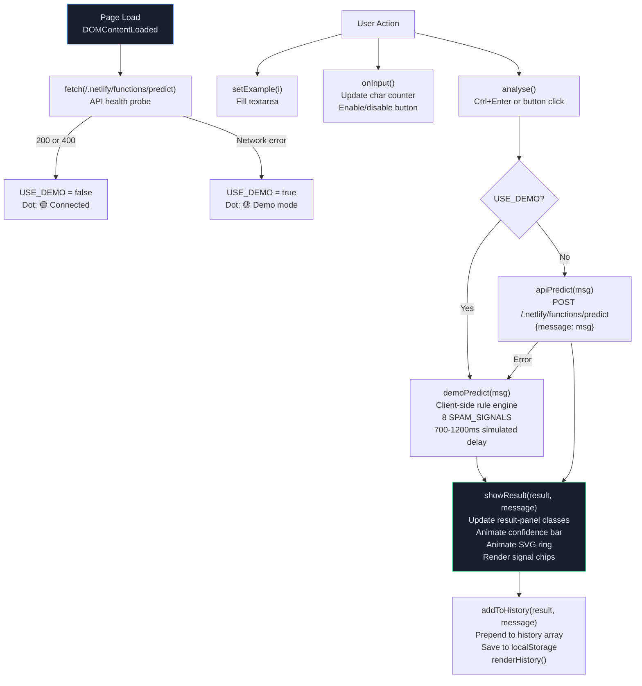
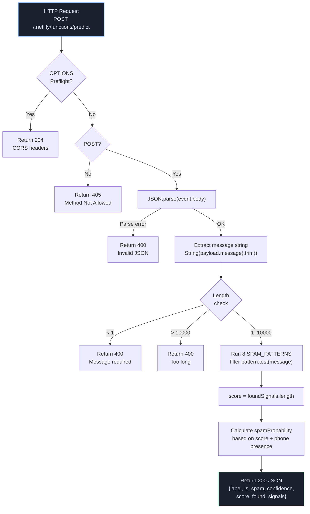

# ⚙️ Low Level Design (LLD)
## SMS Spam Data Exploration — SpamShield

> **Authors:** Alok Chauhan (251810700318) · Aman Kumar (251810700231) · Batch 2C

---

## 1. Project File Structure

```
SMS-Spam-Data-Exploration/
│
├── 📓 01_data_cleaning.ipynb        ← Step 1: Clean raw data, extract 9 features
├── 📓 02_eda_distribution.ipynb     ← Step 2: Exploratory analysis charts
├── 📓 03_text_statistics.ipynb      ← Step 3: Word frequency & n-gram analysis
├── 📓 04_segmentation.ipynb         ← Step 4: Segment analysis & rule mining
│
├── 🐍 train_model.py                ← Step 5: Train 4 ML classifiers, save best
├── 🐍 05_dashboard.py               ← Step 6: Streamlit 6-page dashboard
├── 🐍 save_charts.py                ← Utility: Pre-render all charts as PNG
│
├── 🌐 index.html                    ← Static web app (SpamShield frontend)
│
├── 📁 netlify/
│   └── functions/
│       └── predict.js               ← Serverless prediction API
│
├── 📁 outputs/
│   ├── spam_model.pkl               ← Saved best ML pipeline
│   ├── ml_results.json              ← All model metrics + ROC data
│   ├── 01_quality_chart.png         ← Data quality bar chart
│   └── previews/                    ← Pre-rendered chart PNGs
│       ├── 01_pie_chart.png
│       ├── 02_length_histogram.png
│       ├── 03_wordcount_boxplot.png
│       ├── 04_feature_bars.png
│       ├── 05_top_spam_words.png
│       ├── 06_top_ham_words.png
│       ├── 07_segments_bar.png
│       └── 08_signal_breakdown.png
│
├── 📁 docs/                         ← Design documentation
│   ├── HLD.md
│   ├── LLD.md
│   ├── CFD.md
│   └── DFD.md
│
├── spam.csv                         ← Raw UCI dataset
├── spam_cleaned.csv                 ← Cleaned + feature-enriched dataset
├── requirements.txt                 ← Python deps (version-pinned)
├── netlify.toml                     ← Netlify build config
├── package.json                     ← Project metadata
├── run_dashboard.bat                ← Windows launcher script
└── README.md
```

---

## 2. Module-Level Design

### 2.1 `01_data_cleaning.ipynb` — Data Cleaning Module



**Extracted Columns:**

| Column | Type | Description |
|--------|------|-------------|
| `label` | str | `spam` or `ham` |
| `message` | str | Original SMS text |
| `char_count` | int | Number of characters |
| `word_count` | int | Number of whitespace-separated tokens |
| `has_url` | bool | Contains `http://`, `https://`, or `www.` |
| `has_phone` | bool | Contains ≥10 consecutive digits |
| `has_currency` | bool | Contains `£`, `$`, `€`, or `₹` |
| `has_free` | bool | Word `free` appears |
| `has_call` | bool | Word `call` appears |
| `has_txt` | bool | Word `txt` or `text` appears |
| `spam_signals` | int | Count of True boolean features |
| `label_num` | int | `1` = spam, `0` = ham |

---

### 2.2 `train_model.py` — ML Training Module



**TfidfVectorizer Parameters:**

| Parameter | Value | Reason |
|-----------|-------|--------|
| `max_features` | 6,000 | Limit vocabulary size for performance |
| `ngram_range` | `(1, 2)` | Capture phrases like "call now", "free prize" |
| `sublinear_tf` | `True` | Log-scale TF to reduce impact of high-frequency words |
| `strip_accents` | `"unicode"` | Normalize international characters |
| `min_df` | `2` | Ignore rare tokens (< 2 occurrences) |

---

### 2.3 `05_dashboard.py` — Streamlit Dashboard Module



**Key Functions:**

| Function | Input | Output | Notes |
|----------|-------|--------|-------|
| `find_file(*paths)` | path strings | first existing path or `None` | Enables cross-machine portability |
| `load_data()` | — | `(DataFrame, error_str)` | `@st.cache_data` — loads once |
| `load_ml_results()` | — | `dict` or `None` | Reads `ml_results.json` |
| `load_model()` | — | `(model, status, msg)` | `@st.cache_resource` |
| `clean_words(message)` | str | `List[str]` | Strips punctuation, removes stopwords |
| `check_signals(message)` | str | `Dict[str, bool]` | 9-rule signal checker |
| `spam_verdict(signals, model, msg)` | dict, model, str | `(verdict, score, method)` | ML-first, rule-based fallback |

---

### 2.4 `index.html` — Static Frontend Module



**JavaScript Functions:**

| Function | Purpose |
|----------|---------|
| `onInput()` | Updates char counter; enables Analyse button only if ≥4 chars and not loading |
| `setExample(i)` | Fills textarea with pre-written example message |
| `clearAll()` | Resets textarea, hides result panel, clears `lastResult` |
| `analyse()` | Main async handler — calls API or demo engine |
| `demoPredict(msg)` | Client-side 8-signal rule engine with simulated network delay |
| `apiPredict(msg)` | Fetch POST to Netlify function endpoint |
| `showResult(result, msg)` | Renders result panel with animations (confidence bar + SVG ring) |
| `addToHistory(result, msg)` | Prepends to `localStorage` history (max 30 items) |
| `renderHistory()` | Re-renders full history list with click-to-reload |
| `shareResult()` | Uses Web Share API or clipboard fallback |
| `showApiHelp()` | Prompt to change API endpoint; handles Streamlit URL edge case |
| `animateBars(sel)` | CSS width animation trigger for data visualization bars |

---

### 2.5 `netlify/functions/predict.js` — Serverless API Module



**Spam Probability Scoring Logic:**

| Condition | Spam Probability |
|-----------|-----------------|
| Has phone AND score ≥ 2 | 0.94 |
| score ≥ 4 | 0.91 |
| score = 3 | 0.78 |
| score = 2 | 0.58 |
| score = 1 | 0.29 |
| score = 0 | 0.07 |

---

## 3. Data Schema

### `spam_cleaned.csv` Schema

```
label        : string  → "spam" | "ham"
message      : string  → raw SMS text
char_count   : int     → len(message)
word_count   : int     → len(message.split())
has_url      : bool    → 'http' or 'www.' present
has_phone    : bool    → ≥10 consecutive digit sequence
has_currency : bool    → £, $, €, ₹ present
has_free     : bool    → word 'free' present
has_call     : bool    → word 'call' present
has_txt      : bool    → word 'txt' or 'text' present
spam_signals : int     → sum of boolean features
label_num    : int     → 1=spam, 0=ham
```

### `ml_results.json` Schema

```json
{
  "Model Name": {
    "accuracy": float,
    "precision": float,
    "recall": float,
    "f1": float,
    "roc_auc": float,
    "cv_f1": float,
    "confusion_matrix": [[TN, FP], [FN, TP]],
    "roc_fpr": [float, ...],
    "roc_tpr": [float, ...]
  },
  "_meta": {
    "best_model": string,
    "train_size": int,
    "test_size": int,
    "total_rows": int,
    "spam_count": int,
    "ham_count": int,
    "model_names": [string, ...],
    "tfidf_params": { ... }
  }
}
```

---

## 4. Error Handling Matrix

| Component | Error Condition | Handling Strategy |
|-----------|----------------|-------------------|
| `load_data()` | File not found | Return `(None, error_msg)` → `st.error` + `st.stop()` |
| `load_ml_results()` | File not found / bad JSON | Return `None` → show warning + `st.stop()` on ML page |
| `load_model()` | File not found | Return `(None, "not_found", msg)` → rule-based fallback |
| `load_model()` | joblib load fails | Return `(None, "load_failed", msg)` → sidebar error |
| `spam_verdict()` | `predict_proba` exception | `except Exception: pass` → falls through to rules |
| `05_dashboard.py` | Missing feature columns | `if col in data.columns` guards throughout |
| `index.html` | API network error | `catch()` → `demoPredict()` fallback |
| `index.html` | Clipboard denied | `.catch()` → user-facing toast message |
| `predict.js` | Invalid JSON body | `try/catch JSON.parse` → 400 response |
| `predict.js` | Message > 10,000 chars | Explicit length check → 400 response |
| `train_model.py` | `spam.csv` missing | `os.path.exists` check → `FileNotFoundError` |
| `save_charts.py` | `spam_cleaned.csv` missing | `next(candidates)` check → `FileNotFoundError` |

---

*Document generated: 2026-05-06 · SMS Spam Data Exploration Project*
